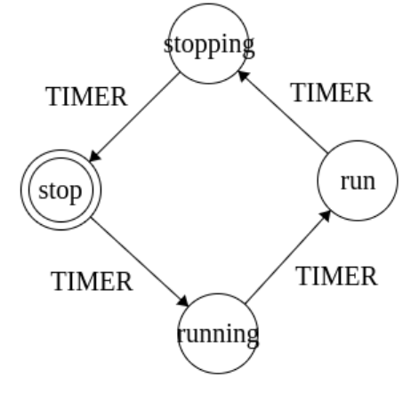
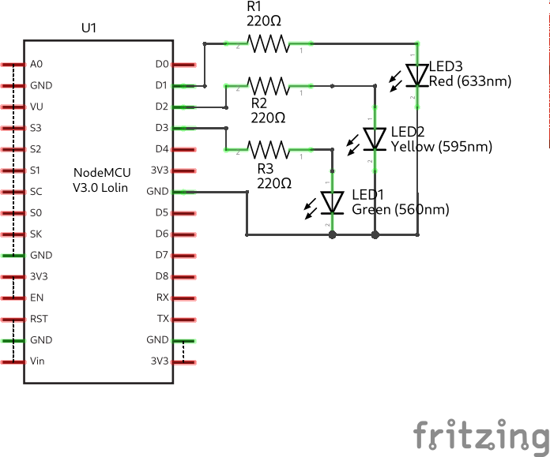
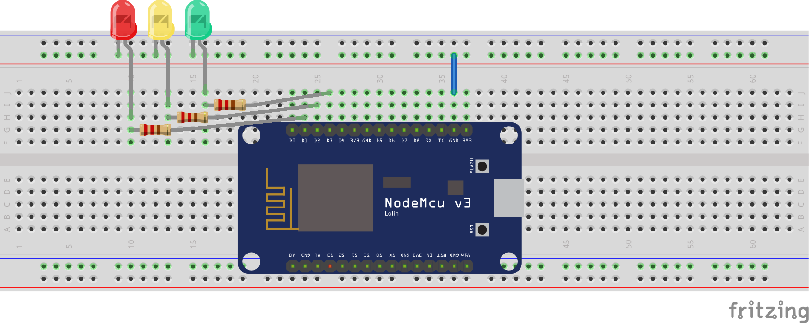
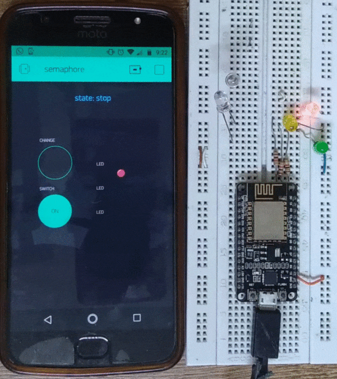

# Semaphore 

This project implements a three color semaphore (red, yellow, green) using an ESP8266 and Blynk IoT framework.

The design was done based in a statechart modeling and implemented as such:
 
 

and the diagram is:

you can try with Blynk application using the following code:

# video and animation

this is the cycle of the semaphore

and you can see the video [here](https://youtu.be/RSwETHQ1iKM)

